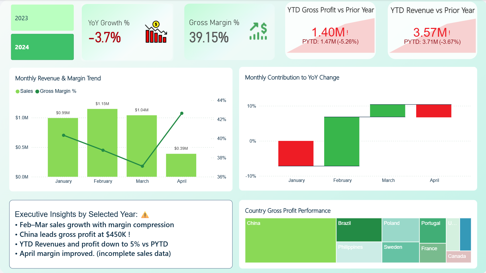
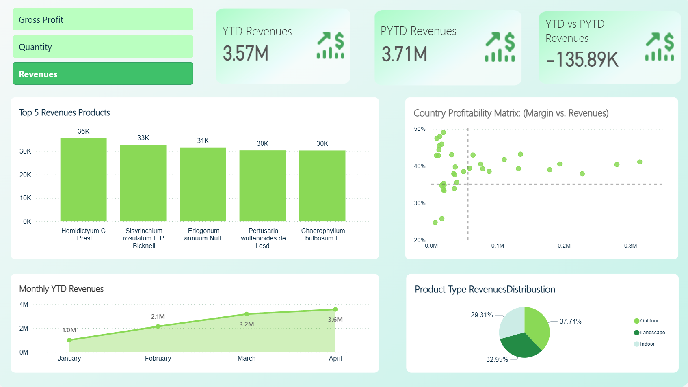
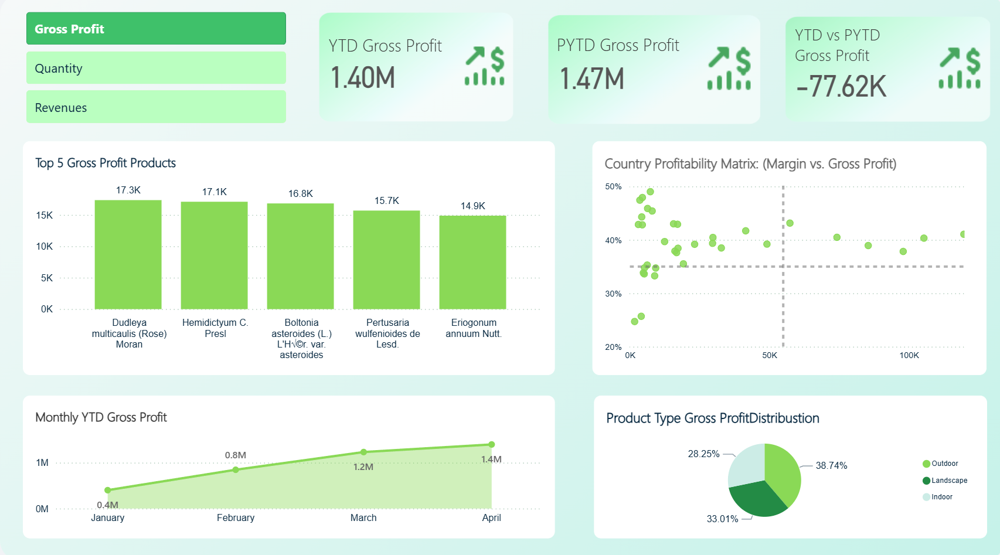

# 🌿 Plant Go. Financial Performance Analysis Dashboard

---

### Businesss Problem:
- **"YoY growth declined by -3.7%, indicating measurable performance pressure that required structured investigation."**

---

## Business Objective:
This project was built to perform a historical financial analysis for Plant Go. in order to understand business performance across time, products, product types, and countries.

The main goal was to extract and evaluate the following:

- Core financial metrics such as revenue, gross profit, gross margin %, quantity, and YoY growth
- Historical data trends in sales and profitability
- Dynamic comparisons between current and prior-year performance
- Product-level, product-type-level, and country-level performance patterns
- Areas of strength, weakness, and strategic opportunity within the business
- Unveiling the true performance hidden in the numbers

The project was designed as an executive-level BI case study rather than a static dashboard, with emphasis on business interpretation, trend analysis, and KPI comparison.

---

## Challenges:
During the development process, several challenges were encountered and resolved:

- Building correct relationships between fact and dimension tables
- Creating a custom date table to support time intelligence calculations
- Designing manual slicers for dynamic metric switching
- Building separate DAX measures for each slicer option
- Implementing YTD, PYTD, and YoY logic consistently
- Cleaning and simplifying the data model to improve performance and usability

---

## Measure Design:
The following measures were created to support the analysis and dashboard interaction:

```text
📁 _Calculations
│
├── 📊 COGS
├── 📊 Gross Margin %
├── 📊 Gross Profit
├── 📊 Quantity
├── 📊 Sales
├── 📊 YoY Growth %
│
├── 📁 PYTD
│   ├── 📊 PYTD_GrossProfit
│   ├── 📊 PYTD_Quantity
│   └── 📊 PYTD_Sales
│
├── 📁 SLICERS
│   ├── 📊 S_PYTD
│   ├── 📊 S_YTD
│   └── 📊 YTD vs PYTD
│
└── 📁 YTD
    ├── 📊 YTD_Gross_Profit
    ├── 📊 YTD_Quantity
    └── 📊 YTD_Sales
```

These measures were used to enable time-based comparisons, profitability analysis, and dynamic metric selection.

---

##  Used Tools:

| Tool | Purpose |
|------|---------|
| Power BI | Dashboard design and data visualization |
| Power Query | Data cleaning, transformation, and preparation |
| DAX | Calculated measures, KPIs, and conditional logic |

---

## The whole analysis process :
The analysis followed a structured workflow that moved from business planning to data modeling, then to visualization and insight extraction.

### Planning(Ask):
The project started by defining the key financial questions that the dashboard should answer, including:

- How are revenue, gross profit, and gross margin performing over time?
- Which quarters and months are stronger or weaker?
- Which countries contribute the most to profitability?
- Which products and product types generate the strongest results?
- How does current-year performance compare with the previous year?

This planning stage helped shape the dashboard into a business-focused analytical solution rather than a purely visual report.

### data cleaning & data Modeling:
The raw dataset was prepared through a series of data cleaning and modeling steps to make the model more reliable and efficient:

- Removed unnecessary columns to reduce model complexity
- Renamed fields for better business readability
- Applied Trim, Replace Values, and Remove Blanks operations
- Built a dedicated `Dim_Date` table
- Created a manual date hierarchy
- Added an `InPast` calculated column for time-aware comparisons
- Linked the fact table with dimension tables in a structured model

### Data Model:


---

## Dashboard Overview :
The dashboard was built into two main pages, each serving a different analytical purpose.

---

### 1- Performance Overview



This page provides an executive summary of the overall financial performance of the company. It is designed to answer the question: **How is the business performing at a high level?**

### What this page shows:
- YTD revenue and gross profit compared with prior-year performance
- Gross margin performance
- Year-over-Year growth
- Monthly revenue and margin trends
- Monthly contribution to YoY movement
- Country-level gross profit distribution
- Dynamic insights that change based on the selected year

### Key insights from this page:
- Q2 and Q4 delivered the strongest revenue and gross profit performance
- Q3 experienced a sharp decline in profitability
- YoY growth remained negative at -3.8%, indicating weaker performance versus the prior year
- China led gross profit contribution at $1.5M, making it the strongest market in the dataset
- Monthly performance showed clear variation, which suggests seasonality and/or uneven operational momentum across the year

### Recommendations from this page:
- Investigate the causes of weak Q3 profitability
- Review whether certain months are affected by seasonality, pricing, or cost structure
- Expand analysis of China to understand what drives its strong gross profit contribution
- Monitor YoY decline drivers more closely to identify operational improvement opportunities
- Use the dynamic yearly insights box to support executive-level interpretation of the selected year

---

### 2- Core Metrics Analysis:





This page is a more detailed analytical view built around a dynamic metric selector. It allows the user to switch between Revenue, Quantity, and Gross Profit, and the visuals update accordingly.

### What this page shows:
- A KPI-style summary for the selected metric
- Top 5 products by the selected measure
- Country profitability matrix showing margin versus revenues
- Monthly trend for the selected metric
- Product type distribution

### Key insights from this page:
- Revenue slightly declined compared to the prior year, showing mild performance pressure
- The top revenue products are relatively close in value, which suggests a balanced revenue base rather than overdependence on one dominant product
- Outdoor products contribute the largest share of revenue, making them the strongest product type in the selected view
- Most countries cluster around moderate to strong gross margins, which suggests generally healthy profitability across markets
- The country profitability matrix shows that some markets combine strong revenue with relatively strong margin, making them attractive strategic segments
- The monthly trend indicates that performance evolved gradually through the year rather than being concentrated in one isolated month

### Recommendations from this page:
- Prioritize high-performing product types, especially those with both strong revenue and strong margin behavior
- Compare top products not only by revenue but also by profitability efficiency
- Review lower-margin countries to identify pricing or cost optimization opportunities
- Use the country matrix to identify markets that are both profitable and scalable
- Extend the analysis in future versions with customer segmentation, pricing analysis, and discount impact analysis

---

## Data Source:
This project simulates a retail and distribution scenario for a hypothetical company (PlantCo) using a synthetic enterprise dataset. It focuses on implementing data modeling best practices (Star Schema) and developing advanced dynamic measures via DAX.
financial

---

## Conclusions and Strategic Value:


Plant Co. recorded a YoY decline of -3.8%, with Q3 representing the weakest 
period and Q2 and Q4 delivering the strongest results.

China led gross profit contribution at $1.5M. Revenue across top products 
was balanced, reducing single-product dependency risk, while most markets 
maintained healthy margin levels.


---

## Author:
**Salman Aljbae**  
Management Information Systems Student | Data  Analyst
Focused on Power BI, SQL, Data Analysis, and Business Intelligence.

